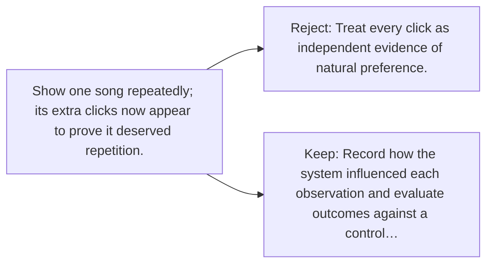

# Diagram — Excavation 066 — Feedback Loops

The picture carries this excavation's particular counterexample and repair.



```text
TRY     Treat every click as independent evidence of natural preference.
BREAK   Show one song repeatedly; its extra clicks now appear to prove it deserved repetition.
REPAIR  Record how the system influenced each observation and evaluate outcomes against a control…
```
