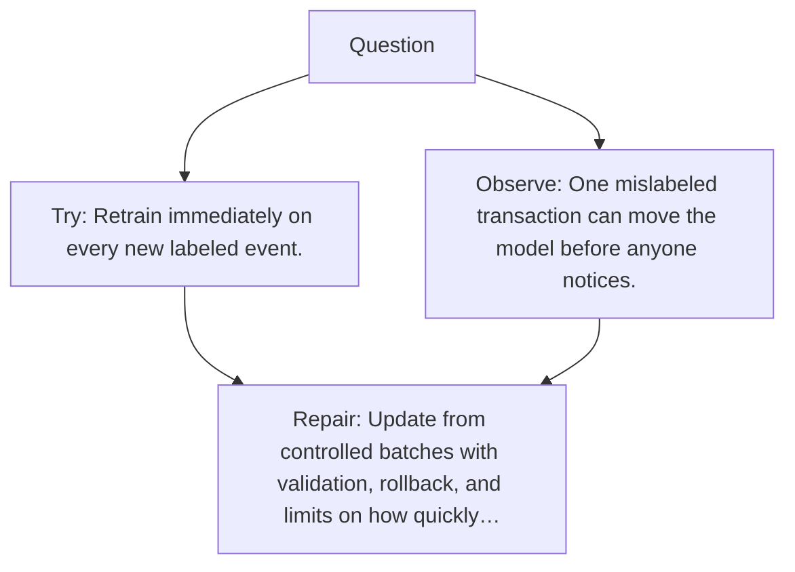

# Diagram — Excavation 067 — Online Learning

The picture carries this excavation's particular counterexample and repair.



```text
TRY     Retrain immediately on every new labeled event.
BREAK   One mislabeled transaction can move the model before anyone notices.
REPAIR  Update from controlled batches with validation, rollback, and limits on how quickly…
```

<!-- memory-film-v1:start -->
## Five-frame memory film

```text
QUESTION       What fails if we retrain immediately on every new labeled event?
     ↓
OBJECT         the online learning lantern mounted on the weathered observation slate
     ↓
VISIBLE BREAK  The lantern follows the tempting path—retrain immediately on every new labeled event. Then the evidence answers: the trouble appears immediately: one mislabeled transaction can move the model before anyone notices.
     ↓
TRANSFORMATION The field naturalist changes one moving part. The lantern can now update from controlled batches with validation, rollback, and limits on how quickly behavior may change.
     ↓
MEMORY SEAL    Online Learning keeps the missing power: update from controlled batches with validation, rollback, and limits on how quickly behavior may change.
```
<!-- memory-film-v1:end -->
