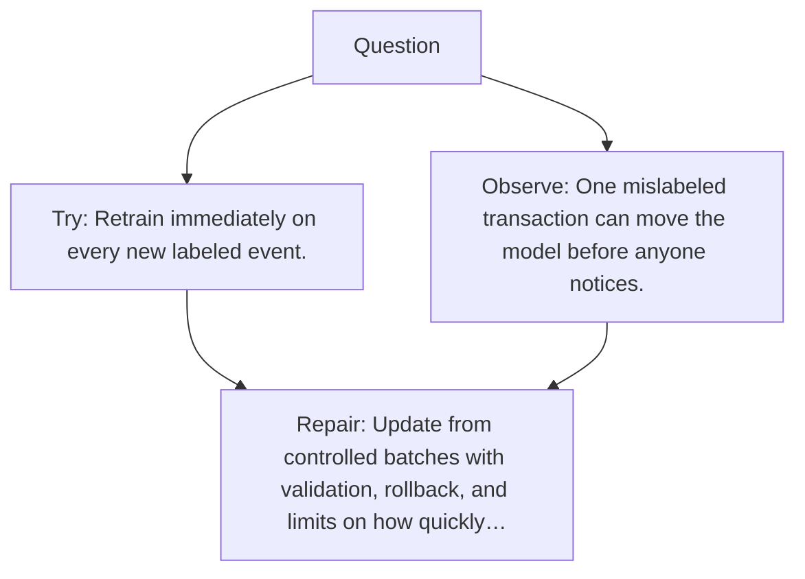

# Diagram — Excavation 067 — Online Learning

The picture carries this excavation's particular counterexample and repair.



```text
TRY     Retrain immediately on every new labeled event.
BREAK   One mislabeled transaction can move the model before anyone notices.
REPAIR  Update from controlled batches with validation, rollback, and limits on how quickly…
```
