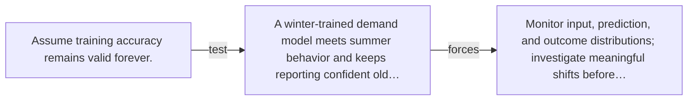

# Diagram — Excavation 068 — Distribution Drift

The picture carries this excavation's particular counterexample and repair.



```text
TRY     Assume training accuracy remains valid forever.
BREAK   A winter-trained demand model meets summer behavior and keeps reporting confident old…
REPAIR  Monitor input, prediction, and outcome distributions; investigate meaningful shifts before…
```
