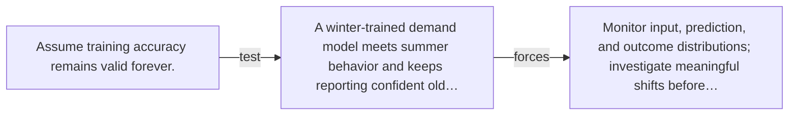

# Diagram — Excavation 068 — Distribution Drift

The picture carries this excavation's particular counterexample and repair.



```text
TRY     Assume training accuracy remains valid forever.
BREAK   A winter-trained demand model meets summer behavior and keeps reporting confident old…
REPAIR  Monitor input, prediction, and outcome distributions; investigate meaningful shifts before…
```

<!-- memory-film-v1:start -->
## Five-frame memory film

```text
QUESTION       What fails if we assume training accuracy remains valid forever?
     ↓
OBJECT         the distribution drift compass mounted on the weathered observation slate
     ↓
VISIBLE BREAK  The compass follows the tempting path—assume training accuracy remains valid forever. Then the evidence answers: a winter-trained demand model meets summer behavior and keeps reporting confident old patterns.
     ↓
TRANSFORMATION The field naturalist changes one moving part. The compass can now monitor input, prediction, and outcome distributions; investigate meaningful shifts before retraining.
     ↓
MEMORY SEAL    Distribution Drift keeps the missing power: monitor input, prediction, and outcome distributions; investigate meaningful shifts before retraining.
```
<!-- memory-film-v1:end -->
