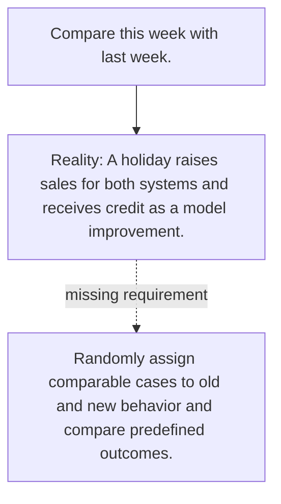

# Diagram — Excavation 069 — Controlled Experiments

The picture carries this excavation's particular counterexample and repair.



```text
TRY     Compare this week with last week.
BREAK   A holiday raises sales for both systems and receives credit as a model improvement.
REPAIR  Randomly assign comparable cases to old and new behavior and compare predefined outcomes.
```

<!-- memory-film-v1:start -->
## Five-frame memory film

```text
QUESTION       What fails if we compare this week with last week?
     ↓
OBJECT         the controlled experiments bridge mounted on the weathered observation slate
     ↓
VISIBLE BREAK  The bridge follows the tempting path—compare this week with last week. Then the evidence answers: a holiday raises sales for both systems and receives credit as a model improvement.
     ↓
TRANSFORMATION The field naturalist changes one moving part. The bridge can now randomly assign comparable cases to old and new behavior and compare predefined outcomes.
     ↓
MEMORY SEAL    Controlled Experiments keeps the missing power: randomly assign comparable cases to old and new behavior and compare predefined outcomes.
```
<!-- memory-film-v1:end -->
