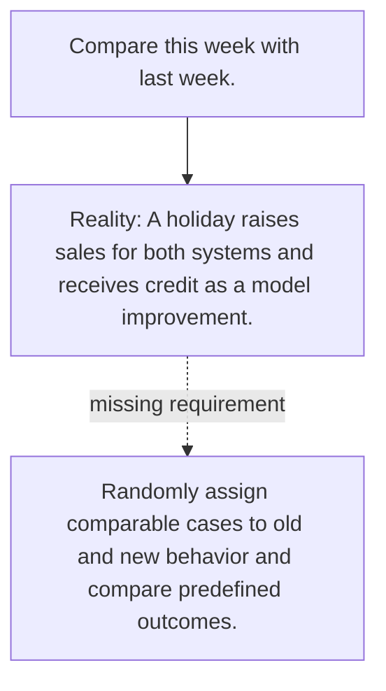

# Diagram — Excavation 069 — Controlled Experiments

The picture carries this excavation's particular counterexample and repair.



```text
TRY     Compare this week with last week.
BREAK   A holiday raises sales for both systems and receives credit as a model improvement.
REPAIR  Randomly assign comparable cases to old and new behavior and compare predefined outcomes.
```
