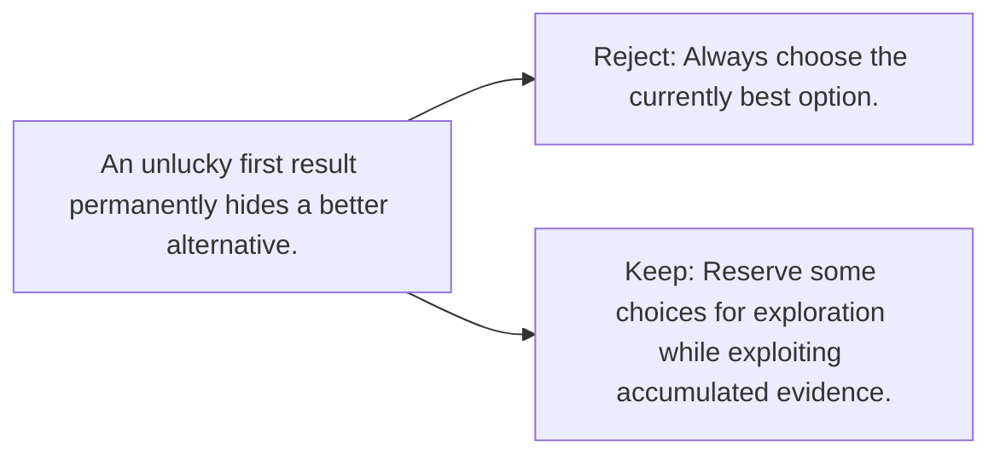

# Diagram — Excavation 070 — Bandits — Learning While Choosing

The picture carries this excavation's particular counterexample and repair.



```text
TRY     Always choose the currently best option.
BREAK   An unlucky first result permanently hides a better alternative.
REPAIR  Reserve some choices for exploration while exploiting accumulated evidence.
```
