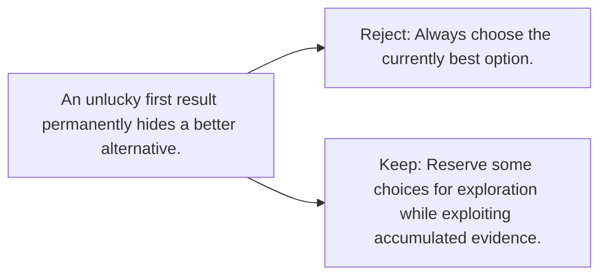

# Diagram — Excavation 070 — Bandits — Learning While Choosing

The picture carries this excavation's particular counterexample and repair.



```text
TRY     Always choose the currently best option.
BREAK   An unlucky first result permanently hides a better alternative.
REPAIR  Reserve some choices for exploration while exploiting accumulated evidence.
```

<!-- memory-film-v1:start -->
## Five-frame memory film

```text
QUESTION       What fails if we always choose the currently best option?
     ↓
OBJECT         the bandits thread mounted on the weathered observation slate
     ↓
VISIBLE BREAK  The thread follows the tempting path—always choose the currently best option. Then the evidence answers: an unlucky first result permanently hides a better alternative.
     ↓
TRANSFORMATION The field naturalist changes one moving part. The thread can now reserve some choices for exploration while exploiting accumulated evidence.
     ↓
MEMORY SEAL    Bandits keeps the missing power: reserve some choices for exploration while exploiting accumulated evidence.
```
<!-- memory-film-v1:end -->
