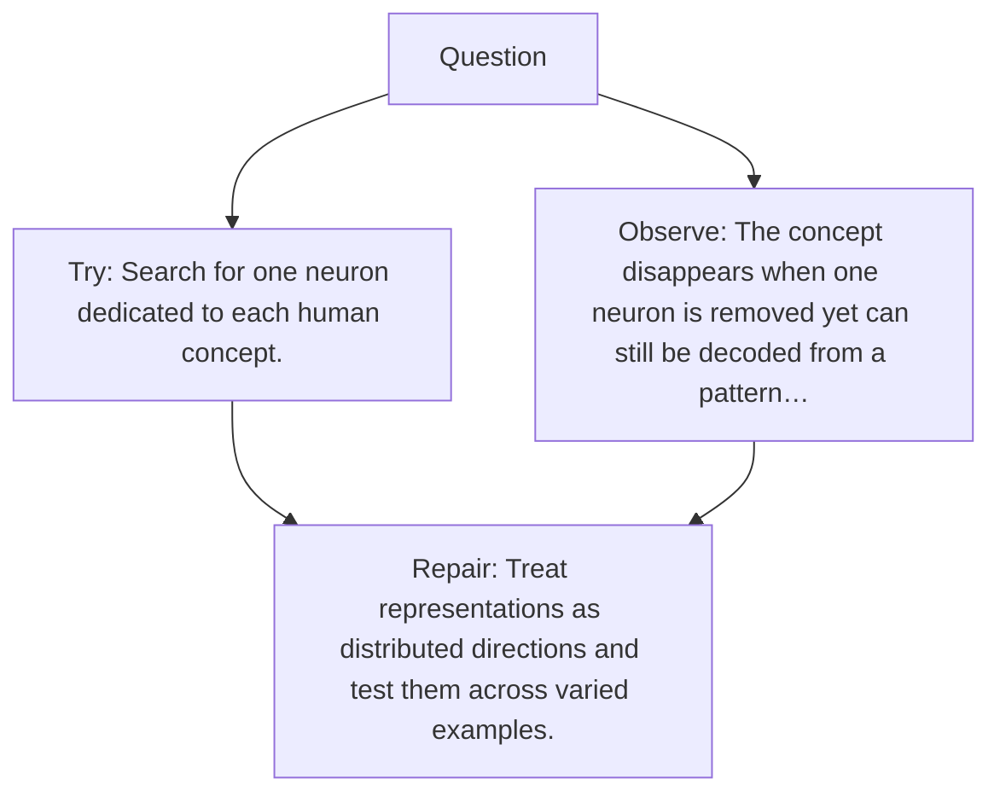

# Diagram — Excavation 071 — Features Inside Networks

The picture carries this excavation's particular counterexample and repair.



```text
TRY     Search for one neuron dedicated to each human concept.
BREAK   The concept disappears when one neuron is removed yet can still be decoded from a pattern…
REPAIR  Treat representations as distributed directions and test them across varied examples.
```
