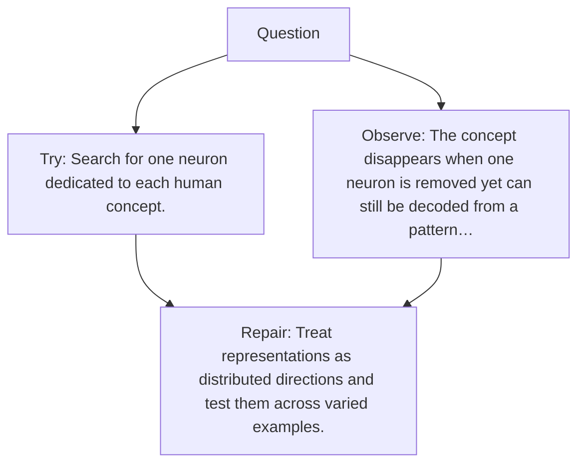

# Diagram — Excavation 071 — Features Inside Networks

The picture carries this excavation's particular counterexample and repair.



```text
TRY     Search for one neuron dedicated to each human concept.
BREAK   The concept disappears when one neuron is removed yet can still be decoded from a pattern…
REPAIR  Treat representations as distributed directions and test them across varied examples.
```

<!-- memory-film-v1:start -->
## Five-frame memory film

```text
QUESTION       What fails if we search for one neuron dedicated to each human concept?
     ↓
OBJECT         the features inside networks mirror mounted on the weathered observation slate
     ↓
VISIBLE BREAK  The mirror follows the tempting path—search for one neuron dedicated to each human concept. Then the evidence answers: the concept disappears when one neuron is removed yet can still be decoded from a pattern across many neurons.
     ↓
TRANSFORMATION The field naturalist changes one moving part. The mirror can now treat representations as distributed directions and test them across varied examples.
     ↓
MEMORY SEAL    Features Inside Networks keeps the missing power: treat representations as distributed directions and test them across varied examples.
```
<!-- memory-film-v1:end -->
