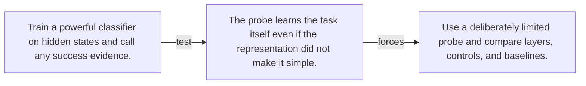

# Diagram — Excavation 072 — Linear Probes

The picture carries this excavation's particular counterexample and repair.



```text
TRY     Train a powerful classifier on hidden states and call any success evidence.
BREAK   The probe learns the task itself even if the representation did not make it simple.
REPAIR  Use a deliberately limited probe and compare layers, controls, and baselines.
```
