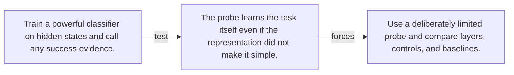

# Diagram — Excavation 072 — Linear Probes

The picture carries this excavation's particular counterexample and repair.



```text
TRY     Train a powerful classifier on hidden states and call any success evidence.
BREAK   The probe learns the task itself even if the representation did not make it simple.
REPAIR  Use a deliberately limited probe and compare layers, controls, and baselines.
```

<!-- memory-film-v1:start -->
## Five-frame memory film

```text
QUESTION       What fails if we train a powerful classifier on hidden states and call any success evidence?
     ↓
OBJECT         the linear probes bell mounted on the weathered observation slate
     ↓
VISIBLE BREAK  The bell follows the tempting path—train a powerful classifier on hidden states and call any success evidence. Then the evidence answers: the trouble appears immediately: the probe learns the task itself even if the representation did not make it simple.
     ↓
TRANSFORMATION The field naturalist changes one moving part. The bell can now use a deliberately limited probe and compare layers, controls, and baselines.
     ↓
MEMORY SEAL    Linear Probes keeps the missing power: use a deliberately limited probe and compare layers, controls, and baselines.
```
<!-- memory-film-v1:end -->
