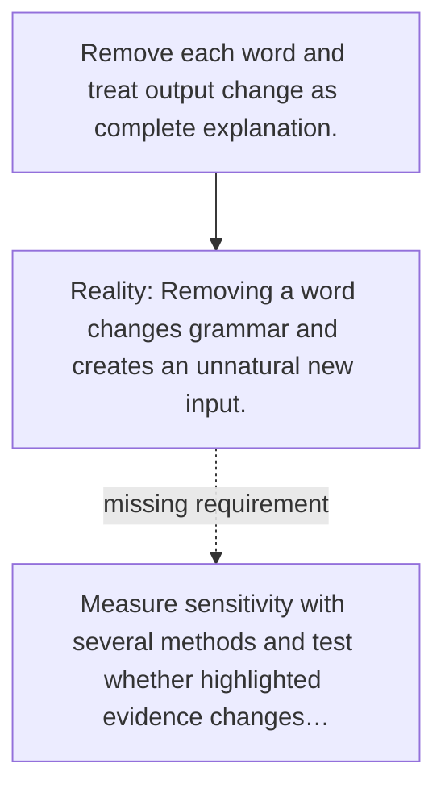

# Diagram — Excavation 073 — Attribution

The picture carries this excavation's particular counterexample and repair.



```text
TRY     Remove each word and treat output change as complete explanation.
BREAK   Removing a word changes grammar and creates an unnatural new input.
REPAIR  Measure sensitivity with several methods and test whether highlighted evidence changes…
```
