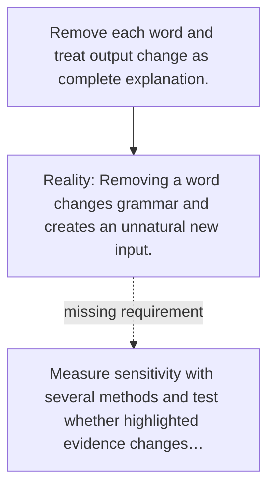

# Diagram — Excavation 073 — Attribution

The picture carries this excavation's particular counterexample and repair.



```text
TRY     Remove each word and treat output change as complete explanation.
BREAK   Removing a word changes grammar and creates an unnatural new input.
REPAIR  Measure sensitivity with several methods and test whether highlighted evidence changes…
```

<!-- memory-film-v1:start -->
## Five-frame memory film

```text
QUESTION       What fails if we remove each word and treat output change as complete explanation?
     ↓
OBJECT         the attribution vessel mounted on the weathered observation slate
     ↓
VISIBLE BREAK  The vessel follows the tempting path—remove each word and treat output change as complete explanation. Then the evidence answers: removing a word changes grammar and creates an unnatural new input.
     ↓
TRANSFORMATION The field naturalist changes one moving part. The vessel can now measure sensitivity with several methods and test whether highlighted evidence changes behavior under controlled interventions.
     ↓
MEMORY SEAL    Attribution keeps the missing power: measure sensitivity with several methods and test whether highlighted evidence changes behavior under controlled interventions.
```
<!-- memory-film-v1:end -->
