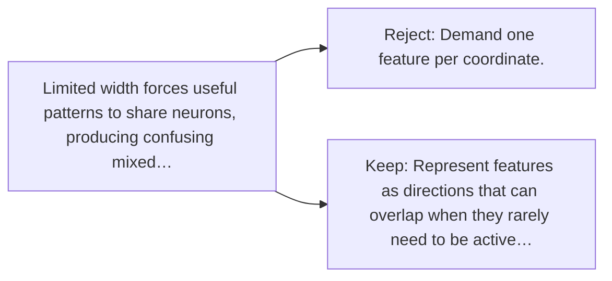

# Diagram — Excavation 074 — Superposition

The picture carries this excavation's particular counterexample and repair.



```text
TRY     Demand one feature per coordinate.
BREAK   Limited width forces useful patterns to share neurons, producing confusing mixed…
REPAIR  Represent features as directions that can overlap when they rarely need to be active…
```
