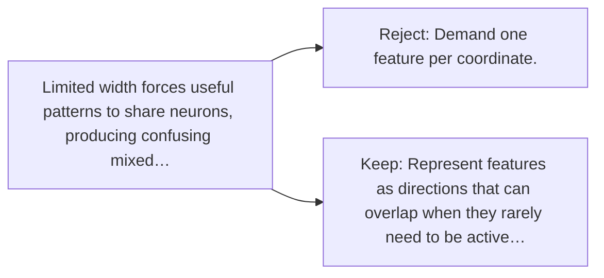

# Diagram — Excavation 074 — Superposition

The picture carries this excavation's particular counterexample and repair.



```text
TRY     Demand one feature per coordinate.
BREAK   Limited width forces useful patterns to share neurons, producing confusing mixed…
REPAIR  Represent features as directions that can overlap when they rarely need to be active…
```

<!-- memory-film-v1:start -->
## Five-frame memory film

```text
QUESTION       What fails if we demand one feature per coordinate?
     ↓
OBJECT         the superposition gate mounted on the weathered observation slate
     ↓
VISIBLE BREAK  The gate follows the tempting path—demand one feature per coordinate. Then the evidence answers: limited width forces useful patterns to share neurons, producing confusing mixed activations.
     ↓
TRANSFORMATION The field naturalist changes one moving part. The gate can now represent features as directions that can overlap when they rarely need to be active together.
     ↓
MEMORY SEAL    Superposition keeps the missing power: represent features as directions that can overlap when they rarely need to be active together.
```
<!-- memory-film-v1:end -->
