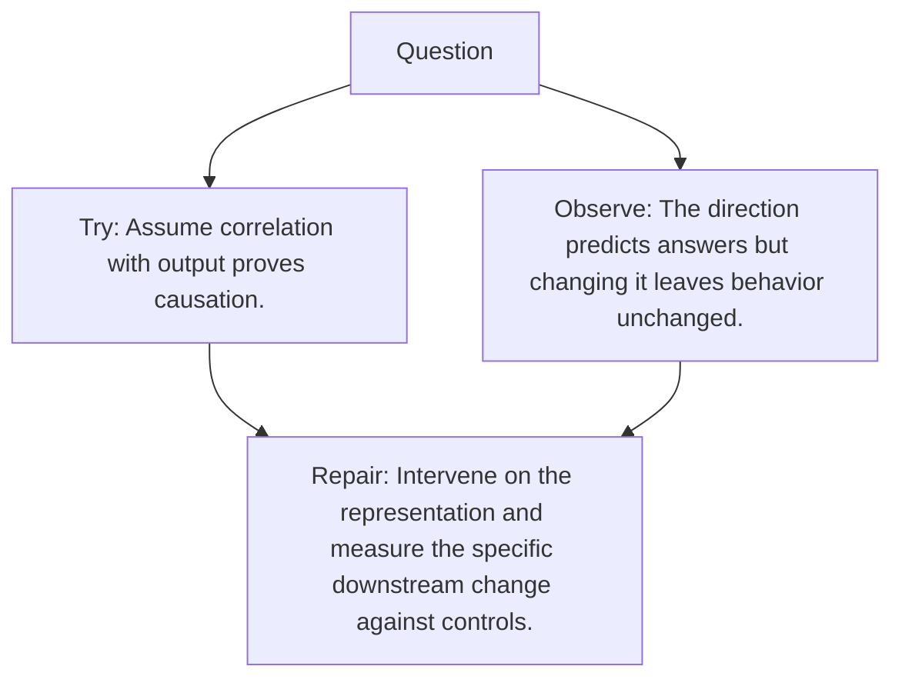

# Diagram — Excavation 075 — Causal Interventions

The picture carries this excavation's particular counterexample and repair.



```text
TRY     Assume correlation with output proves causation.
BREAK   The direction predicts answers but changing it leaves behavior unchanged.
REPAIR  Intervene on the representation and measure the specific downstream change against controls.
```
