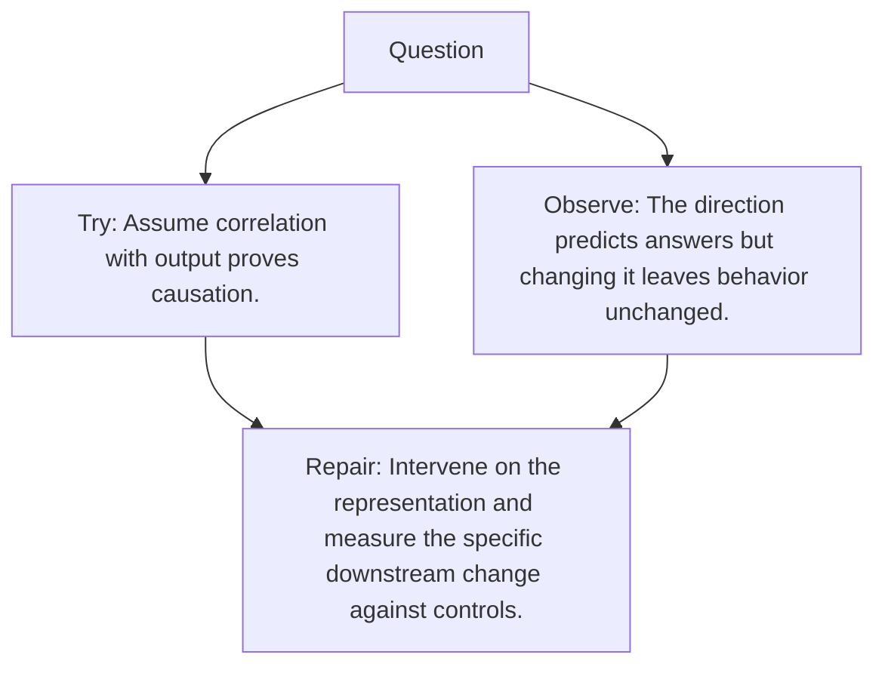

# Diagram — Excavation 075 — Causal Interventions

The picture carries this excavation's particular counterexample and repair.



```text
TRY     Assume correlation with output proves causation.
BREAK   The direction predicts answers but changing it leaves behavior unchanged.
REPAIR  Intervene on the representation and measure the specific downstream change against controls.
```

<!-- memory-film-v1:start -->
## Five-frame memory film

```text
QUESTION       What fails if we assume correlation with output proves causation?
     ↓
OBJECT         the causal interventions wheel mounted on the weathered observation slate
     ↓
VISIBLE BREAK  The wheel follows the tempting path—assume correlation with output proves causation. Then the evidence answers: the direction predicts answers but changing it leaves behavior unchanged.
     ↓
TRANSFORMATION The field naturalist changes one moving part. The wheel can now intervene on the representation and measure the specific downstream change against controls.
     ↓
MEMORY SEAL    Causal Interventions keeps the missing power: intervene on the representation and measure the specific downstream change against controls.
```
<!-- memory-film-v1:end -->
