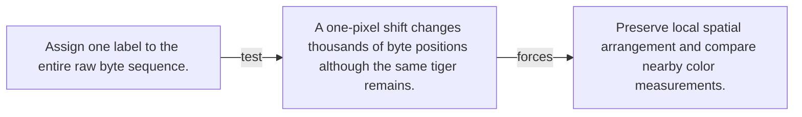

# Diagram — Excavation 076 — Pixels — Turning Light into Numbers

The picture carries this excavation's particular counterexample and repair.



```text
TRY     Assign one label to the entire raw byte sequence.
BREAK   A one-pixel shift changes thousands of byte positions although the same tiger remains.
REPAIR  Preserve local spatial arrangement and compare nearby color measurements.
```
