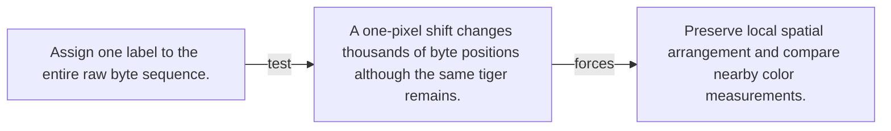

# Diagram — Excavation 076 — Pixels — Turning Light into Numbers

The picture carries this excavation's particular counterexample and repair.



```text
TRY     Assign one label to the entire raw byte sequence.
BREAK   A one-pixel shift changes thousands of byte positions although the same tiger remains.
REPAIR  Preserve local spatial arrangement and compare nearby color measurements.
```

<!-- memory-film-v1:start -->
## Five-frame memory film

```text
QUESTION       What fails if we assign one label to the entire raw byte sequence?
     ↓
OBJECT         the pixels map mounted on the wall of illuminated tiles
     ↓
VISIBLE BREAK  The map follows the tempting path—assign one label to the entire raw byte sequence. Then the evidence answers: a one-pixel shift changes thousands of byte positions although the same tiger remains.
     ↓
TRANSFORMATION The maker of seeing-machines changes one moving part. The map can now preserve local spatial arrangement and compare nearby color measurements.
     ↓
MEMORY SEAL    Pixels keeps the missing power: preserve local spatial arrangement and compare nearby color measurements.
```
<!-- memory-film-v1:end -->
