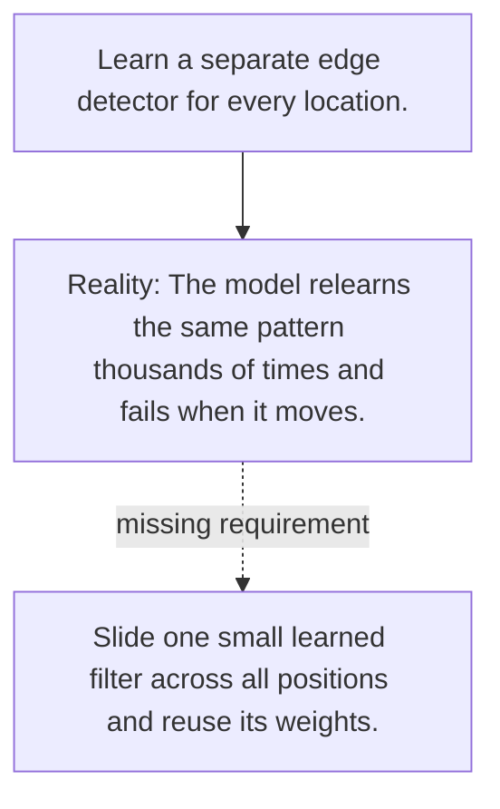

# Diagram — Excavation 077 — Convolution — Reusing the Same Local Detector

The picture carries this excavation's particular counterexample and repair.



```text
TRY     Learn a separate edge detector for every location.
BREAK   The model relearns the same pattern thousands of times and fails when it moves.
REPAIR  Slide one small learned filter across all positions and reuse its weights.
```
