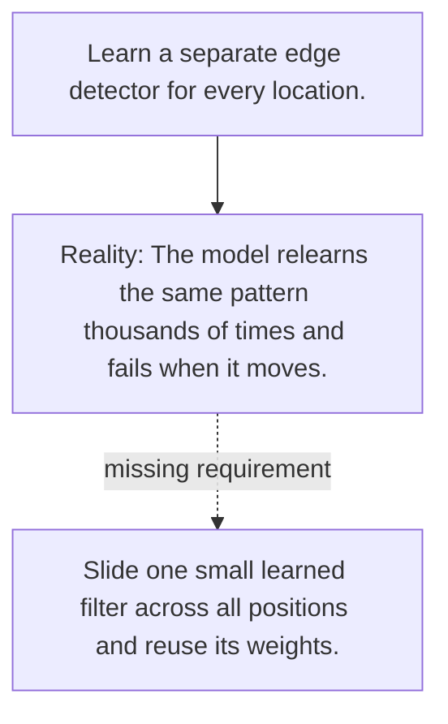

# Diagram — Excavation 077 — Convolution — Reusing the Same Local Detector

The picture carries this excavation's particular counterexample and repair.



```text
TRY     Learn a separate edge detector for every location.
BREAK   The model relearns the same pattern thousands of times and fails when it moves.
REPAIR  Slide one small learned filter across all positions and reuse its weights.
```

<!-- memory-film-v1:start -->
## Five-frame memory film

```text
QUESTION       What fails if we learn a separate edge detector for every location?
     ↓
OBJECT         the convolution scale mounted on the wall of illuminated tiles
     ↓
VISIBLE BREAK  The scale follows the tempting path—learn a separate edge detector for every location. Then the evidence answers: the trouble appears immediately: the model relearns the same pattern thousands of times and fails when it moves.
     ↓
TRANSFORMATION The maker of seeing-machines changes one moving part. The scale can now slide one small learned filter across all positions and reuse its weights.
     ↓
MEMORY SEAL    Convolution keeps the missing power: slide one small learned filter across all positions and reuse its weights.
```
<!-- memory-film-v1:end -->
