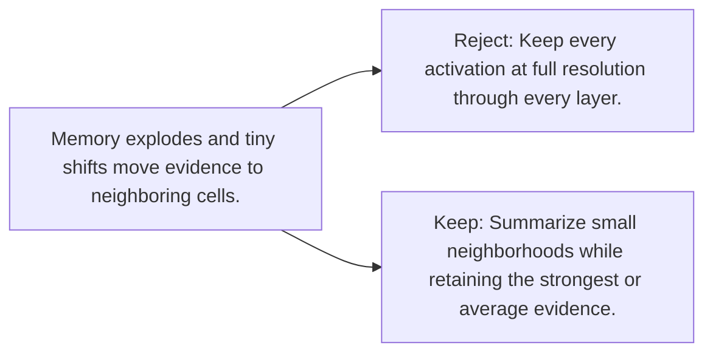

# Diagram — Excavation 078 — Pooling — Keeping Evidence While Shrinking the Map

The picture carries this excavation's particular counterexample and repair.



```text
TRY     Keep every activation at full resolution through every layer.
BREAK   Memory explodes and tiny shifts move evidence to neighboring cells.
REPAIR  Summarize small neighborhoods while retaining the strongest or average evidence.
```
