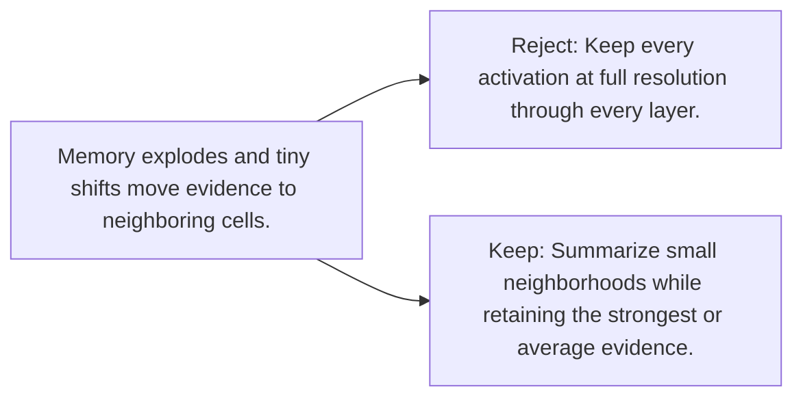

# Diagram — Excavation 078 — Pooling — Keeping Evidence While Shrinking the Map

The picture carries this excavation's particular counterexample and repair.



```text
TRY     Keep every activation at full resolution through every layer.
BREAK   Memory explodes and tiny shifts move evidence to neighboring cells.
REPAIR  Summarize small neighborhoods while retaining the strongest or average evidence.
```

<!-- memory-film-v1:start -->
## Five-frame memory film

```text
QUESTION       What fails if we keep every activation at full resolution through every layer?
     ↓
OBJECT         the pooling gear mounted on the wall of illuminated tiles
     ↓
VISIBLE BREAK  The gear follows the tempting path—keep every activation at full resolution through every layer. Then the evidence answers: memory explodes and tiny shifts move evidence to neighboring cells.
     ↓
TRANSFORMATION The maker of seeing-machines changes one moving part. The gear can now summarize small neighborhoods while retaining the strongest or average evidence.
     ↓
MEMORY SEAL    Pooling keeps the missing power: summarize small neighborhoods while retaining the strongest or average evidence.
```
<!-- memory-film-v1:end -->
