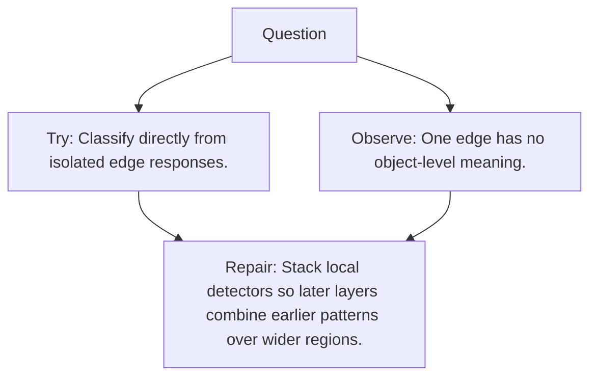

# Diagram — Excavation 079 — CNN Hierarchies

The picture carries this excavation's particular counterexample and repair.



```text
TRY     Classify directly from isolated edge responses.
BREAK   One edge has no object-level meaning.
REPAIR  Stack local detectors so later layers combine earlier patterns over wider regions.
```

<!-- memory-film-v1:start -->
## Five-frame memory film

```text
QUESTION       What fails if we classify directly from isolated edge responses?
     ↓
OBJECT         the cnn hierarchies prism mounted on the wall of illuminated tiles
     ↓
VISIBLE BREAK  The prism follows the tempting path—classify directly from isolated edge responses. Then the evidence answers: one edge has no object-level meaning.
     ↓
TRANSFORMATION The maker of seeing-machines changes one moving part. The prism can now stack local detectors so later layers combine earlier patterns over wider regions.
     ↓
MEMORY SEAL    CNN Hierarchies keeps the missing power: stack local detectors so later layers combine earlier patterns over wider regions.
```
<!-- memory-film-v1:end -->
