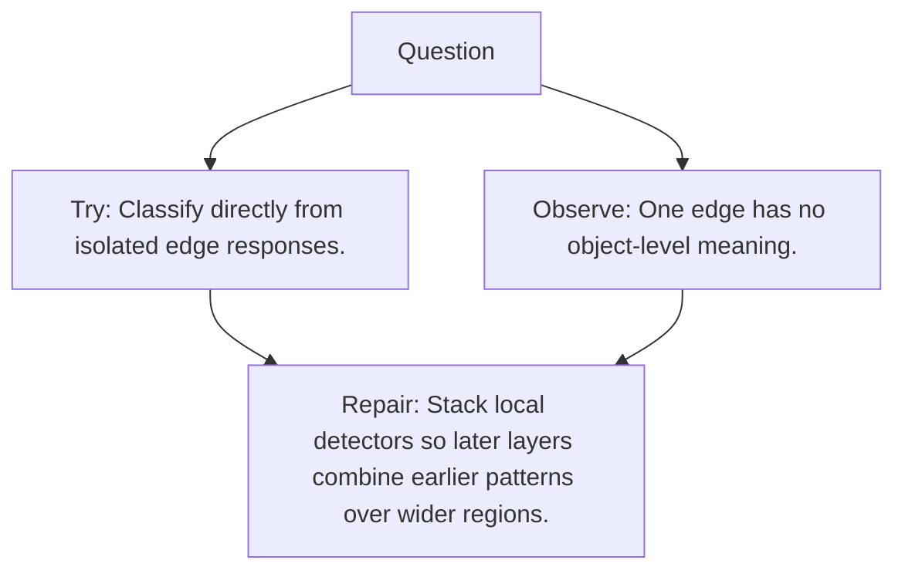

# Diagram — Excavation 079 — CNN Hierarchies

The picture carries this excavation's particular counterexample and repair.



```text
TRY     Classify directly from isolated edge responses.
BREAK   One edge has no object-level meaning.
REPAIR  Stack local detectors so later layers combine earlier patterns over wider regions.
```
