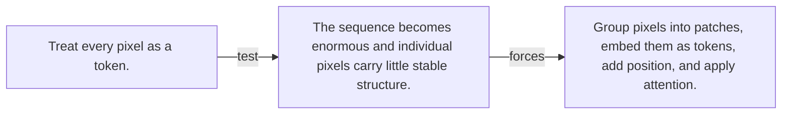

# Diagram — Excavation 080 — Vision Transformers

The picture carries this excavation's particular counterexample and repair.



```text
TRY     Treat every pixel as a token.
BREAK   The sequence becomes enormous and individual pixels carry little stable structure.
REPAIR  Group pixels into patches, embed them as tokens, add position, and apply attention.
```
