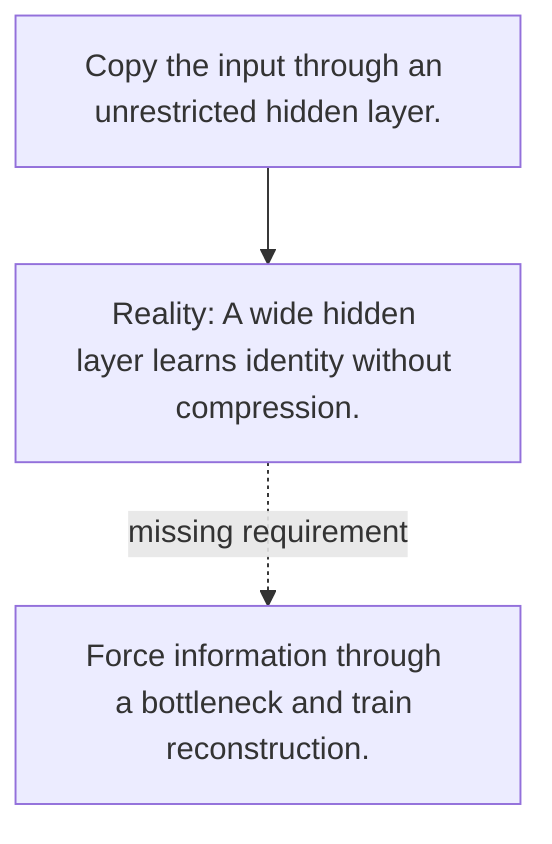

# Diagram — Excavation 081 — Autoencoders — Compressing and Rebuilding

The picture carries this excavation's particular counterexample and repair.



```text
TRY     Copy the input through an unrestricted hidden layer.
BREAK   A wide hidden layer learns identity without compression.
REPAIR  Force information through a bottleneck and train reconstruction.
```
