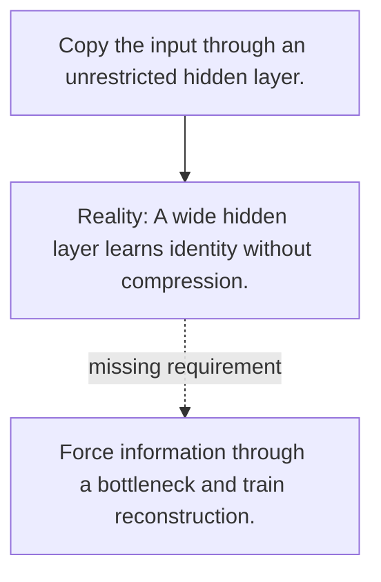

# Diagram — Excavation 081 — Autoencoders — Compressing and Rebuilding

The picture carries this excavation's particular counterexample and repair.



```text
TRY     Copy the input through an unrestricted hidden layer.
BREAK   A wide hidden layer learns identity without compression.
REPAIR  Force information through a bottleneck and train reconstruction.
```

<!-- memory-film-v1:start -->
## Five-frame memory film

```text
QUESTION       What fails if we copy the input through an unrestricted hidden layer?
     ↓
OBJECT         the autoencoders lens mounted on the wall of illuminated tiles
     ↓
VISIBLE BREAK  The lens follows the tempting path—copy the input through an unrestricted hidden layer. Then the evidence answers: a wide hidden layer learns identity without compression.
     ↓
TRANSFORMATION The maker of seeing-machines changes one moving part. The lens can now force information through a bottleneck and train reconstruction.
     ↓
MEMORY SEAL    Autoencoders keeps the missing power: force information through a bottleneck and train reconstruction.
```
<!-- memory-film-v1:end -->
