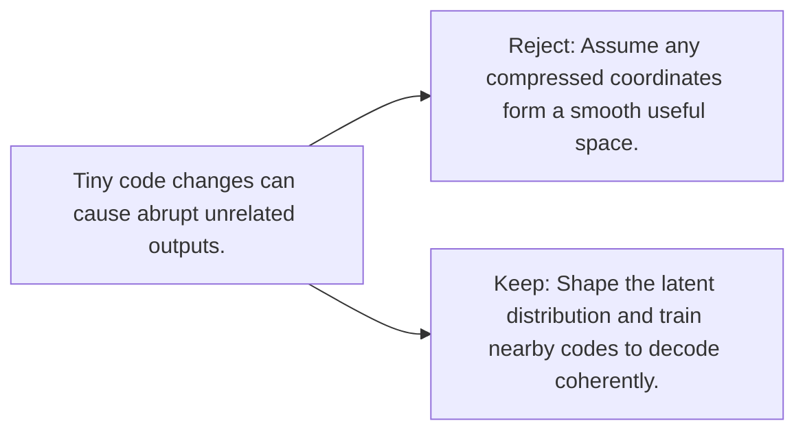

# Diagram — Excavation 082 — Latent Space — Coordinates for Hidden Causes

The picture carries this excavation's particular counterexample and repair.



```text
TRY     Assume any compressed coordinates form a smooth useful space.
BREAK   Tiny code changes can cause abrupt unrelated outputs.
REPAIR  Shape the latent distribution and train nearby codes to decode coherently.
```
