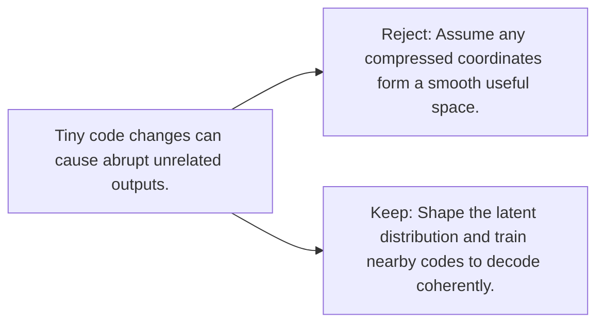

# Diagram — Excavation 082 — Latent Space — Coordinates for Hidden Causes

The picture carries this excavation's particular counterexample and repair.



```text
TRY     Assume any compressed coordinates form a smooth useful space.
BREAK   Tiny code changes can cause abrupt unrelated outputs.
REPAIR  Shape the latent distribution and train nearby codes to decode coherently.
```

<!-- memory-film-v1:start -->
## Five-frame memory film

```text
QUESTION       What fails if we assume any compressed coordinates form a smooth useful space?
     ↓
OBJECT         the latent space key mounted on the wall of illuminated tiles
     ↓
VISIBLE BREAK  The key follows the tempting path—assume any compressed coordinates form a smooth useful space. Then the evidence answers: the trouble appears immediately: tiny code changes can cause abrupt unrelated outputs.
     ↓
TRANSFORMATION The maker of seeing-machines changes one moving part. The key can now shape the latent distribution and train nearby codes to decode coherently.
     ↓
MEMORY SEAL    Latent Space keeps the missing power: shape the latent distribution and train nearby codes to decode coherently.
```
<!-- memory-film-v1:end -->
