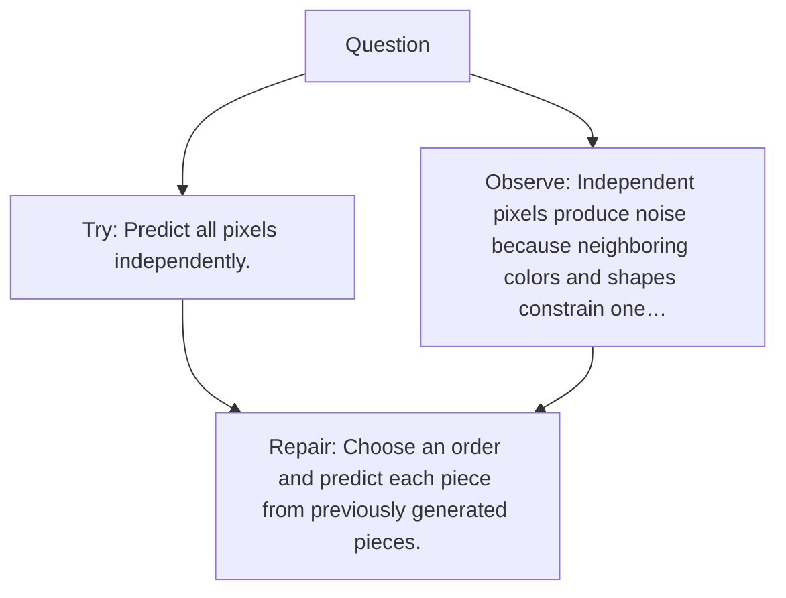

# Diagram — Excavation 083 — Autoregressive Generation Beyond Text

The picture carries this excavation's particular counterexample and repair.



```text
TRY     Predict all pixels independently.
BREAK   Independent pixels produce noise because neighboring colors and shapes constrain one…
REPAIR  Choose an order and predict each piece from previously generated pieces.
```
