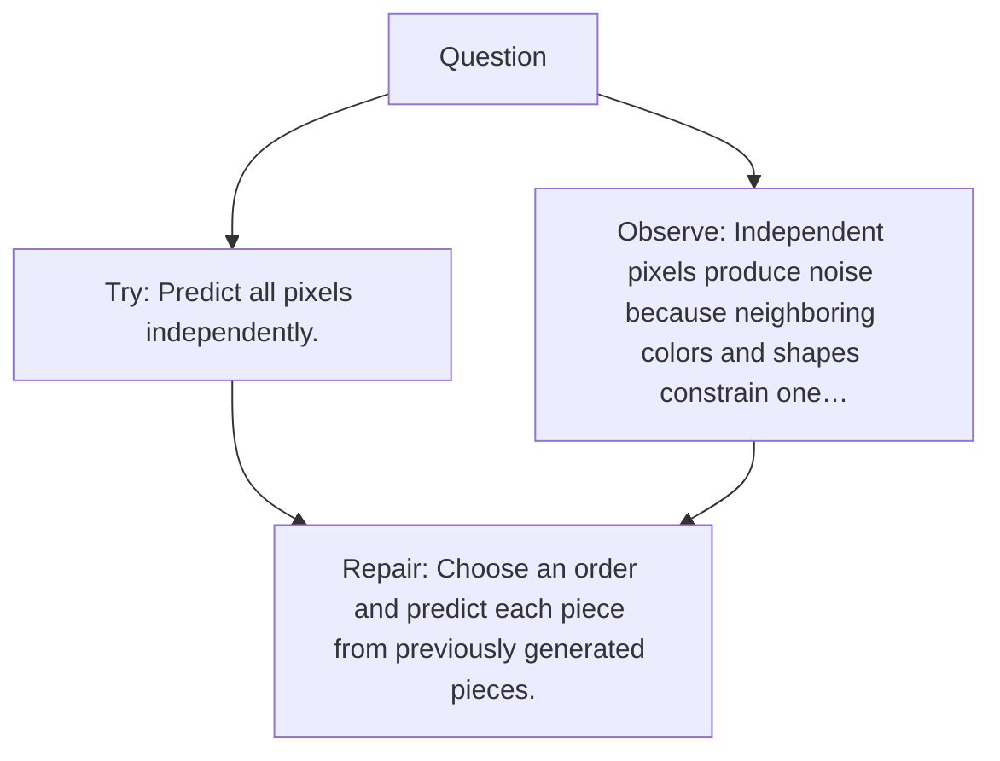

# Diagram — Excavation 083 — Autoregressive Generation Beyond Text

The picture carries this excavation's particular counterexample and repair.



```text
TRY     Predict all pixels independently.
BREAK   Independent pixels produce noise because neighboring colors and shapes constrain one…
REPAIR  Choose an order and predict each piece from previously generated pieces.
```

<!-- memory-film-v1:start -->
## Five-frame memory film

```text
QUESTION       What fails if we predict all pixels independently?
     ↓
OBJECT         the autoregressive generation beyond text lantern mounted on the wall of illuminated tiles
     ↓
VISIBLE BREAK  The lantern follows the tempting path—predict all pixels independently. Then the evidence answers: independent pixels produce noise because neighboring colors and shapes constrain one another.
     ↓
TRANSFORMATION The maker of seeing-machines changes one moving part. The lantern can now choose an order and predict each piece from previously generated pieces.
     ↓
MEMORY SEAL    Autoregressive Generation Beyond Text keeps the missing power: choose an order and predict each piece from previously generated pieces.
```
<!-- memory-film-v1:end -->
