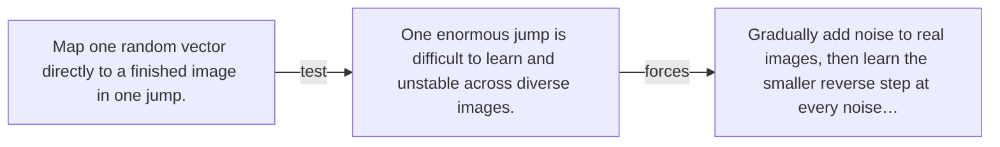

# Diagram — Excavation 084 — Diffusion — Learning by Destroying

The picture carries this excavation's particular counterexample and repair.



```text
TRY     Map one random vector directly to a finished image in one jump.
BREAK   One enormous jump is difficult to learn and unstable across diverse images.
REPAIR  Gradually add noise to real images, then learn the smaller reverse step at every noise…
```
