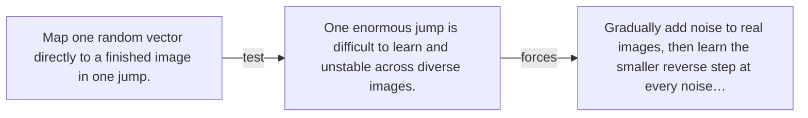

# Diagram — Excavation 084 — Diffusion — Learning by Destroying

The picture carries this excavation's particular counterexample and repair.



```text
TRY     Map one random vector directly to a finished image in one jump.
BREAK   One enormous jump is difficult to learn and unstable across diverse images.
REPAIR  Gradually add noise to real images, then learn the smaller reverse step at every noise…
```

<!-- memory-film-v1:start -->
## Five-frame memory film

```text
QUESTION       What fails if we map one random vector directly to a finished image in one jump?
     ↓
OBJECT         the diffusion compass mounted on the wall of illuminated tiles
     ↓
VISIBLE BREAK  The compass follows the tempting path—map one random vector directly to a finished image in one jump. Then the evidence answers: one enormous jump is difficult to learn and unstable across diverse images.
     ↓
TRANSFORMATION The maker of seeing-machines changes one moving part. The compass can now gradually add noise to real images, then learn the smaller reverse step at every noise level.
     ↓
MEMORY SEAL    Diffusion keeps the missing power: gradually add noise to real images, then learn the smaller reverse step at every noise level.
```
<!-- memory-film-v1:end -->
