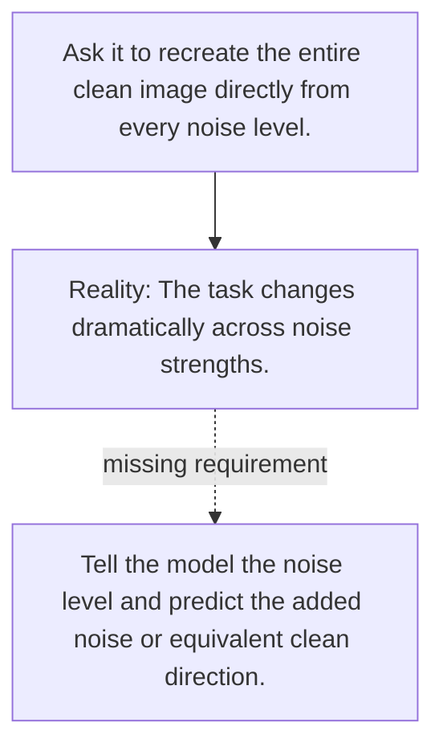

# Diagram — Excavation 085 — Denoising — Predicting What the Noise Hid

The picture carries this excavation's particular counterexample and repair.



```text
TRY     Ask it to recreate the entire clean image directly from every noise level.
BREAK   The task changes dramatically across noise strengths.
REPAIR  Tell the model the noise level and predict the added noise or equivalent clean direction.
```

<!-- memory-film-v1:start -->
## Five-frame memory film

```text
QUESTION       What fails if we ask it to recreate the entire clean image directly from every noise level?
     ↓
OBJECT         the denoising bridge mounted on the wall of illuminated tiles
     ↓
VISIBLE BREAK  The bridge follows the tempting path—ask it to recreate the entire clean image directly from every noise level. Then the evidence answers: the task changes dramatically across noise strengths.
     ↓
TRANSFORMATION The maker of seeing-machines changes one moving part. The bridge can now tell the model the noise level and predict the added noise or equivalent clean direction.
     ↓
MEMORY SEAL    Denoising keeps the missing power: tell the model the noise level and predict the added noise or equivalent clean direction.
```
<!-- memory-film-v1:end -->
