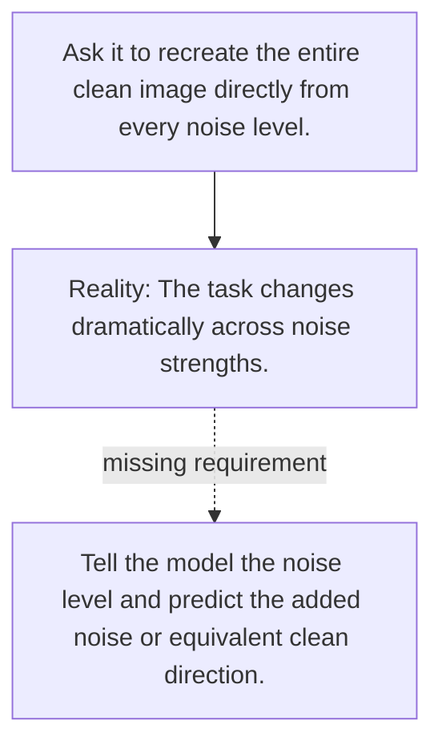

# Diagram — Excavation 085 — Denoising — Predicting What the Noise Hid

The picture carries this excavation's particular counterexample and repair.



```text
TRY     Ask it to recreate the entire clean image directly from every noise level.
BREAK   The task changes dramatically across noise strengths.
REPAIR  Tell the model the noise level and predict the added noise or equivalent clean direction.
```
