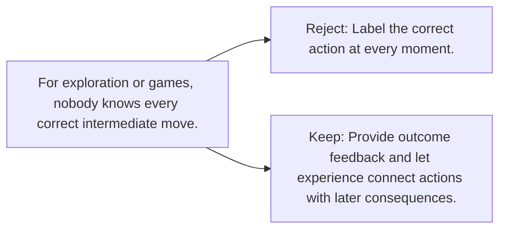

# Diagram — Excavation 086 — Rewards — Learning Without Correct Answers

The picture carries this excavation's particular counterexample and repair.



```text
TRY     Label the correct action at every moment.
BREAK   For exploration or games, nobody knows every correct intermediate move.
REPAIR  Provide outcome feedback and let experience connect actions with later consequences.
```

<!-- memory-film-v1:start -->
## Five-frame memory film

```text
QUESTION       What fails if we label the correct action at every moment?
     ↓
OBJECT         the rewards thread mounted on the map of branching journeys
     ↓
VISIBLE BREAK  The thread follows the tempting path—label the correct action at every moment. Then the evidence answers: for exploration or games, nobody knows every correct intermediate move.
     ↓
TRANSFORMATION The expedition leader changes one moving part. The thread can now provide outcome feedback and let experience connect actions with later consequences.
     ↓
MEMORY SEAL    Rewards keeps the missing power: provide outcome feedback and let experience connect actions with later consequences.
```
<!-- memory-film-v1:end -->
