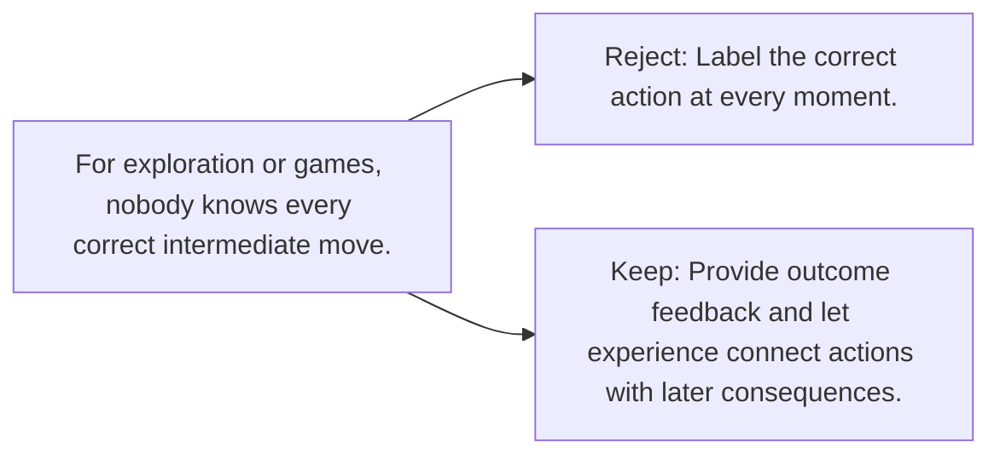

# Diagram — Excavation 086 — Rewards — Learning Without Correct Answers

The picture carries this excavation's particular counterexample and repair.



```text
TRY     Label the correct action at every moment.
BREAK   For exploration or games, nobody knows every correct intermediate move.
REPAIR  Provide outcome feedback and let experience connect actions with later consequences.
```
