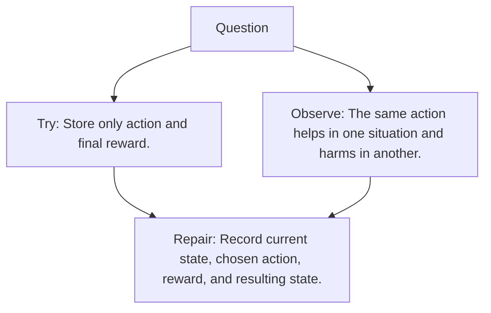

# Diagram — Excavation 087 — States, Actions, and Transitions

The picture carries this excavation's particular counterexample and repair.



```text
TRY     Store only action and final reward.
BREAK   The same action helps in one situation and harms in another.
REPAIR  Record current state, chosen action, reward, and resulting state.
```

<!-- memory-film-v1:start -->
## Five-frame memory film

```text
QUESTION       What fails if we store only action and final reward?
     ↓
OBJECT         the states, actions, and transitions mirror mounted on the map of branching journeys
     ↓
VISIBLE BREAK  The mirror follows the tempting path—store only action and final reward. Then the evidence answers: the trouble appears immediately: the same action helps in one situation and harms in another.
     ↓
TRANSFORMATION The expedition leader changes one moving part. The mirror can now record current state, chosen action, reward, and resulting state.
     ↓
MEMORY SEAL    States, Actions, and Transitions keeps the missing power: record current state, chosen action, reward, and resulting state.
```
<!-- memory-film-v1:end -->
