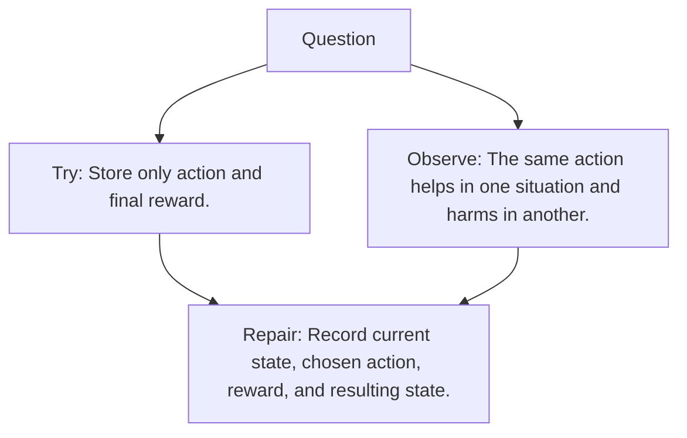

# Diagram — Excavation 087 — States, Actions, and Transitions

The picture carries this excavation's particular counterexample and repair.



```text
TRY     Store only action and final reward.
BREAK   The same action helps in one situation and harms in another.
REPAIR  Record current state, chosen action, reward, and resulting state.
```
