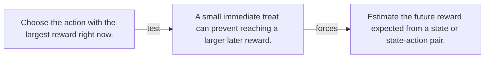

# Diagram — Excavation 088 — Value — Estimating Future Consequences

The picture carries this excavation's particular counterexample and repair.



```text
TRY     Choose the action with the largest reward right now.
BREAK   A small immediate treat can prevent reaching a larger later reward.
REPAIR  Estimate the future reward expected from a state or state-action pair.
```
