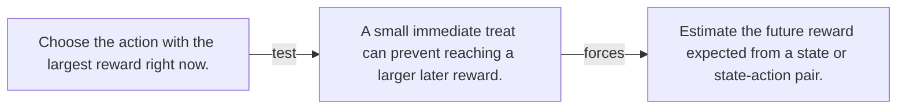

# Diagram — Excavation 088 — Value — Estimating Future Consequences

The picture carries this excavation's particular counterexample and repair.



```text
TRY     Choose the action with the largest reward right now.
BREAK   A small immediate treat can prevent reaching a larger later reward.
REPAIR  Estimate the future reward expected from a state or state-action pair.
```

<!-- memory-film-v1:start -->
## Five-frame memory film

```text
QUESTION       What fails if we choose the action with the largest reward right now?
     ↓
OBJECT         the value bell mounted on the map of branching journeys
     ↓
VISIBLE BREAK  The bell follows the tempting path—choose the action with the largest reward right now. Then the evidence answers: a small immediate treat can prevent reaching a larger later reward.
     ↓
TRANSFORMATION The expedition leader changes one moving part. The bell can now estimate the future reward expected from a state or state-action pair.
     ↓
MEMORY SEAL    Value keeps the missing power: estimate the future reward expected from a state or state-action pair.
```
<!-- memory-film-v1:end -->
