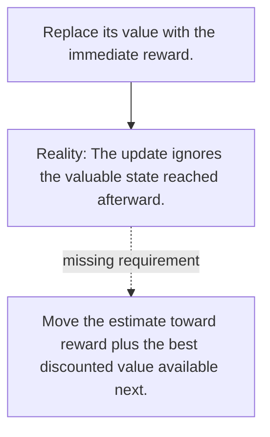

# Diagram — Excavation 089 — Q-Learning — Improving Values from Experience

The picture carries this excavation's particular counterexample and repair.



```text
TRY     Replace its value with the immediate reward.
BREAK   The update ignores the valuable state reached afterward.
REPAIR  Move the estimate toward reward plus the best discounted value available next.
```
