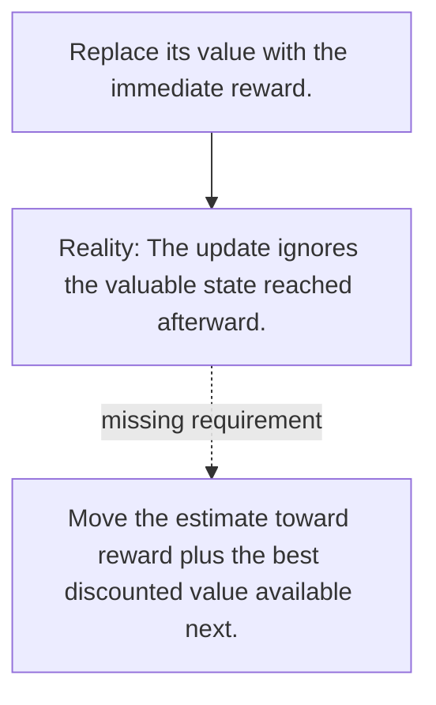

# Diagram — Excavation 089 — Q-Learning — Improving Values from Experience

The picture carries this excavation's particular counterexample and repair.



```text
TRY     Replace its value with the immediate reward.
BREAK   The update ignores the valuable state reached afterward.
REPAIR  Move the estimate toward reward plus the best discounted value available next.
```

<!-- memory-film-v1:start -->
## Five-frame memory film

```text
QUESTION       What fails if we replace its value with the immediate reward?
     ↓
OBJECT         the q-learning vessel mounted on the map of branching journeys
     ↓
VISIBLE BREAK  The vessel follows the tempting path—replace its value with the immediate reward. Then the evidence answers: the update ignores the valuable state reached afterward.
     ↓
TRANSFORMATION The expedition leader changes one moving part. The vessel can now move the estimate toward reward plus the best discounted value available next.
     ↓
MEMORY SEAL    Q-Learning keeps the missing power: move the estimate toward reward plus the best discounted value available next.
```
<!-- memory-film-v1:end -->
