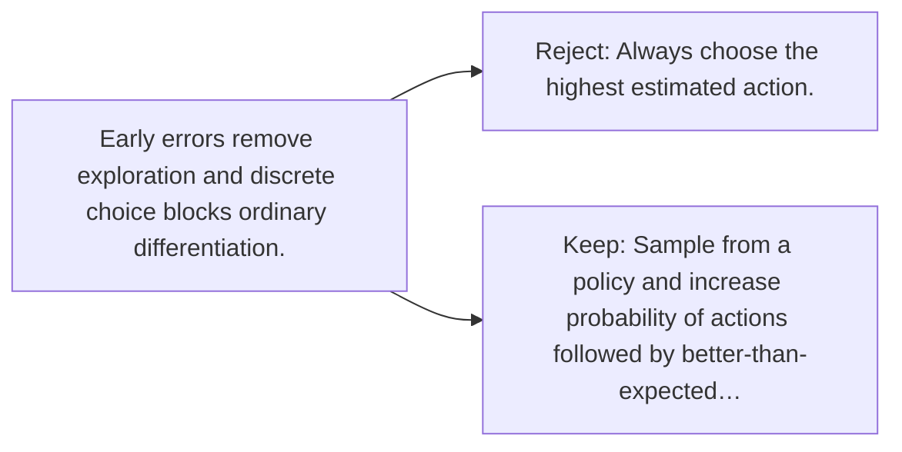

# Diagram — Excavation 090 — Policy Gradients — Improving the Choices Directly

The picture carries this excavation's particular counterexample and repair.



```text
TRY     Always choose the highest estimated action.
BREAK   Early errors remove exploration and discrete choice blocks ordinary differentiation.
REPAIR  Sample from a policy and increase probability of actions followed by better-than-expected…
```
