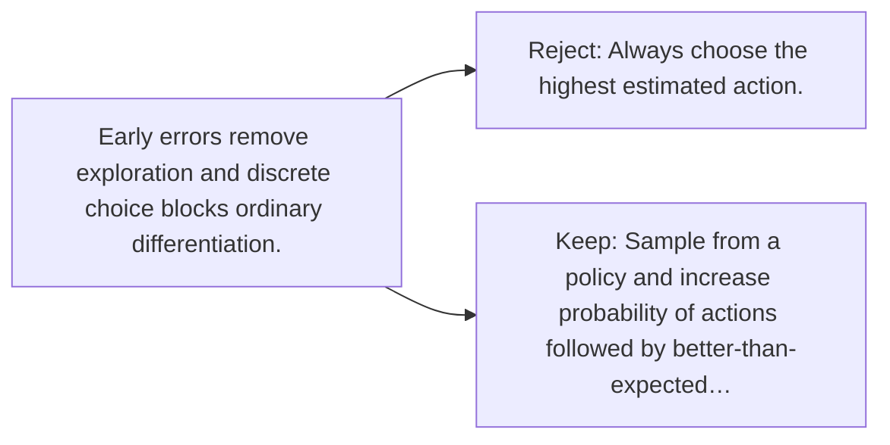

# Diagram — Excavation 090 — Policy Gradients — Improving the Choices Directly

The picture carries this excavation's particular counterexample and repair.



```text
TRY     Always choose the highest estimated action.
BREAK   Early errors remove exploration and discrete choice blocks ordinary differentiation.
REPAIR  Sample from a policy and increase probability of actions followed by better-than-expected…
```

<!-- memory-film-v1:start -->
## Five-frame memory film

```text
QUESTION       What fails if we always choose the highest estimated action?
     ↓
OBJECT         the policy gradients gate mounted on the map of branching journeys
     ↓
VISIBLE BREAK  The gate follows the tempting path—always choose the highest estimated action. Then the evidence answers: early errors remove exploration and discrete choice blocks ordinary differentiation.
     ↓
TRANSFORMATION The expedition leader changes one moving part. The gate can now sample from a policy and increase probability of actions followed by better-than-expected returns.
     ↓
MEMORY SEAL    Policy Gradients keeps the missing power: sample from a policy and increase probability of actions followed by better-than-expected returns.
```
<!-- memory-film-v1:end -->
