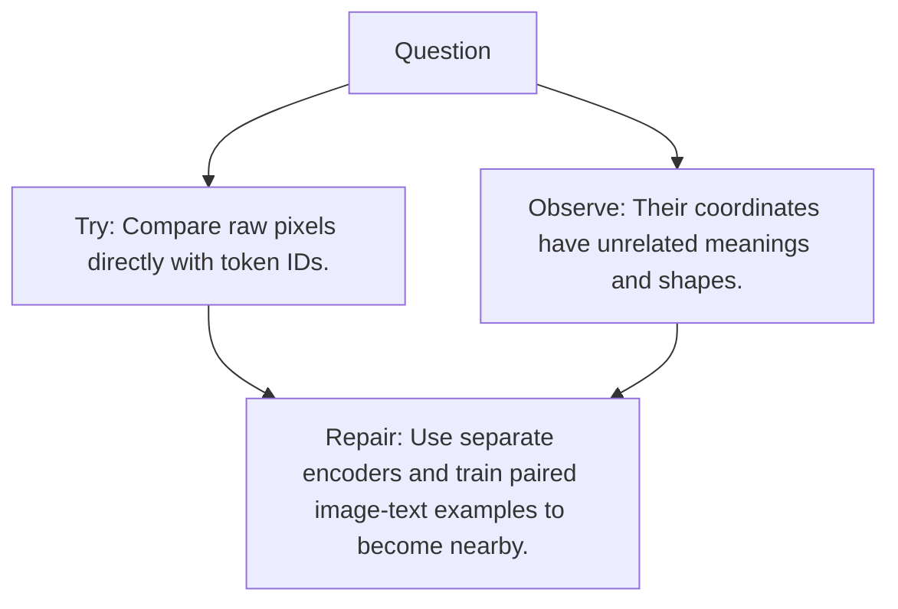

# Diagram — Excavation 091 — Multimodal Alignment

The picture carries this excavation's particular counterexample and repair.



```text
TRY     Compare raw pixels directly with token IDs.
BREAK   Their coordinates have unrelated meanings and shapes.
REPAIR  Use separate encoders and train paired image-text examples to become nearby.
```
