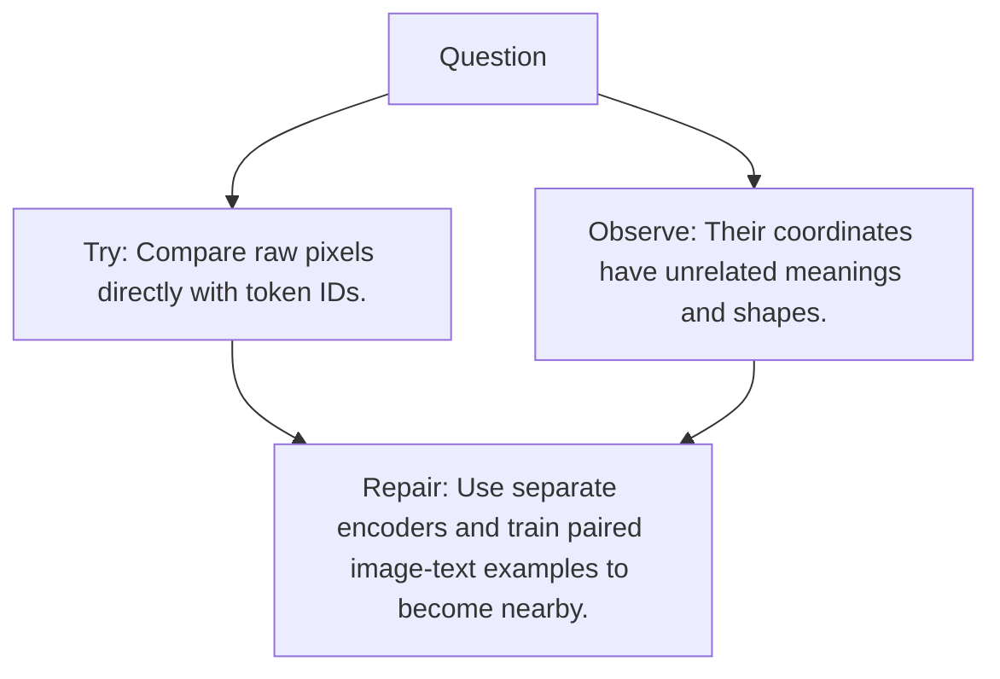

# Diagram — Excavation 091 — Multimodal Alignment

The picture carries this excavation's particular counterexample and repair.



```text
TRY     Compare raw pixels directly with token IDs.
BREAK   Their coordinates have unrelated meanings and shapes.
REPAIR  Use separate encoders and train paired image-text examples to become nearby.
```

<!-- memory-film-v1:start -->
## Five-frame memory film

```text
QUESTION       What fails if we compare raw pixels directly with token IDs?
     ↓
OBJECT         the multimodal alignment wheel mounted on the map of branching journeys
     ↓
VISIBLE BREAK  The wheel follows the tempting path—compare raw pixels directly with token IDs. Then the evidence answers: their coordinates have unrelated meanings and shapes.
     ↓
TRANSFORMATION The expedition leader changes one moving part. The wheel can now use separate encoders and train paired image-text examples to become nearby.
     ↓
MEMORY SEAL    Multimodal Alignment keeps the missing power: use separate encoders and train paired image-text examples to become nearby.
```
<!-- memory-film-v1:end -->
